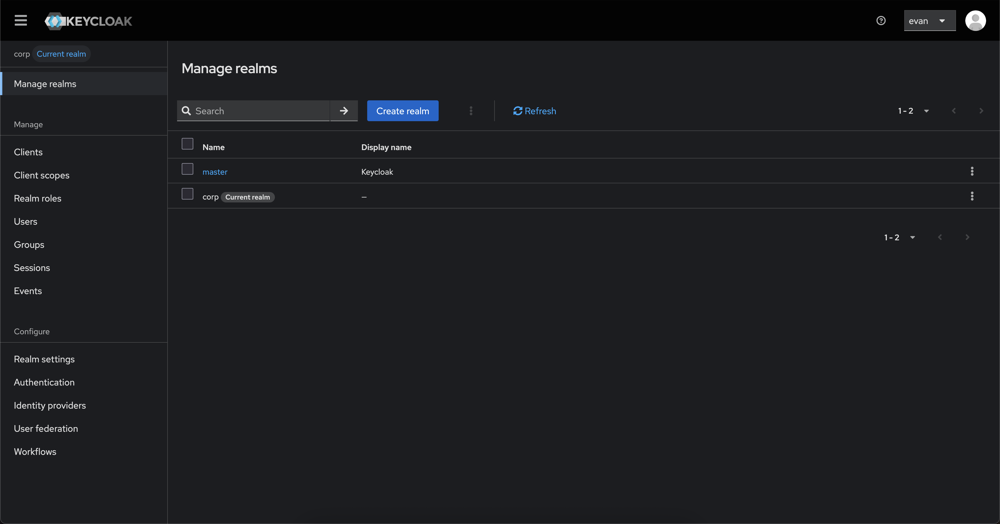
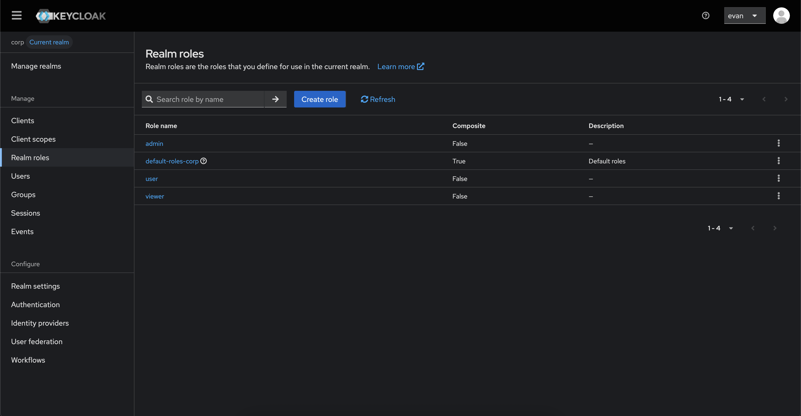
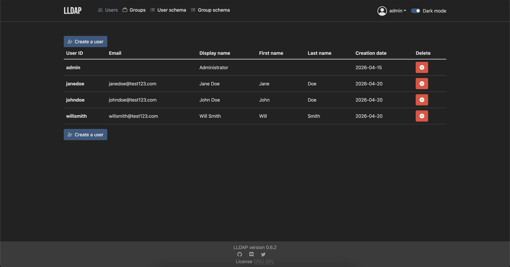
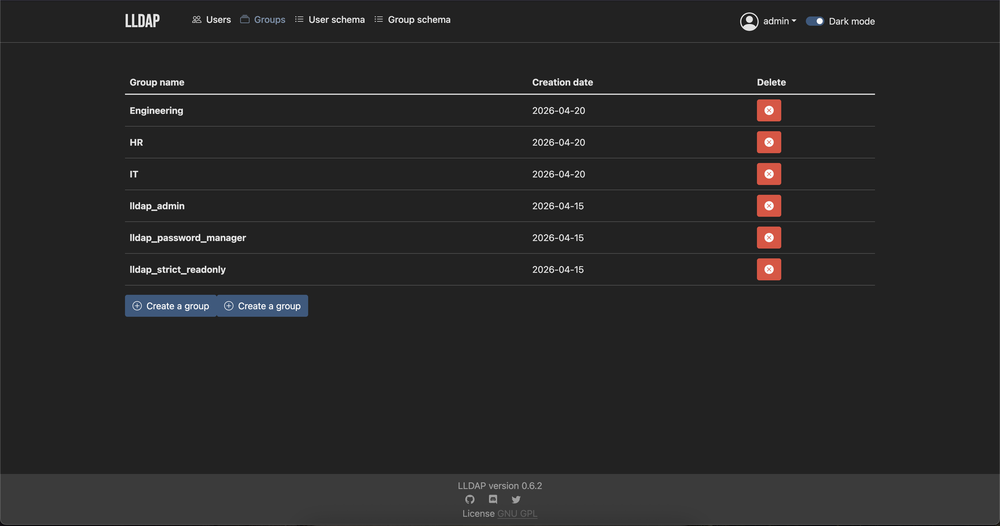
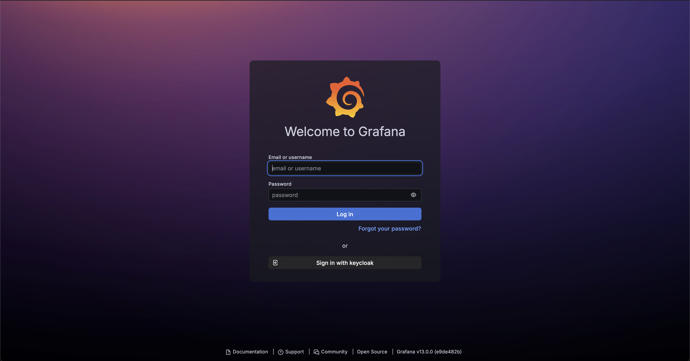

# 🔐 Keycloak IAM Homelab 

## 📌 Overview

This project implements a full Identity and Access Management (IAM) lab using:

- Keycloak as the Identity Provider (IdP)
- Grafana as a relying party (application)
- LLDAP as an external directory (identity source)

It demonstrates real-world IAM architecture patterns including:

- Single Sign-On (SSO) via OpenID Connect (OIDC)
- Multi-Factor Authentication (MFA) using TOTP
- Identity Federation (LDAP → Keycloak)
- Role-Based Access Control (RBAC)
- Token-based API authentication (JWT)

---

## 🔐 Keycloak Setup

 

---

## 👥 LLDAP Setup

 
 

---

## 🔗 LDAP Federation

Connection URL: ldap://lldap:3890  
Bind DN: uid=admin,ou=people,dc=homelab,dc=local  
Users DN: ou=people,dc=homelab,dc=local  

---

## 🔑 Grafana SSO

 
 

---

## 🛡️ RBAC

ROLE_ATTRIBUTE_PATH=contains(realm_access.roles[*], 'admin') && 'Admin' || contains(realm_access.roles[*], 'user') && 'Editor' || 'Viewer'

---

## 📸 Screenshots

- screenshots/sso/
- screenshots/mfa/
- screenshots/ldap/
- screenshots/rbac/

---
