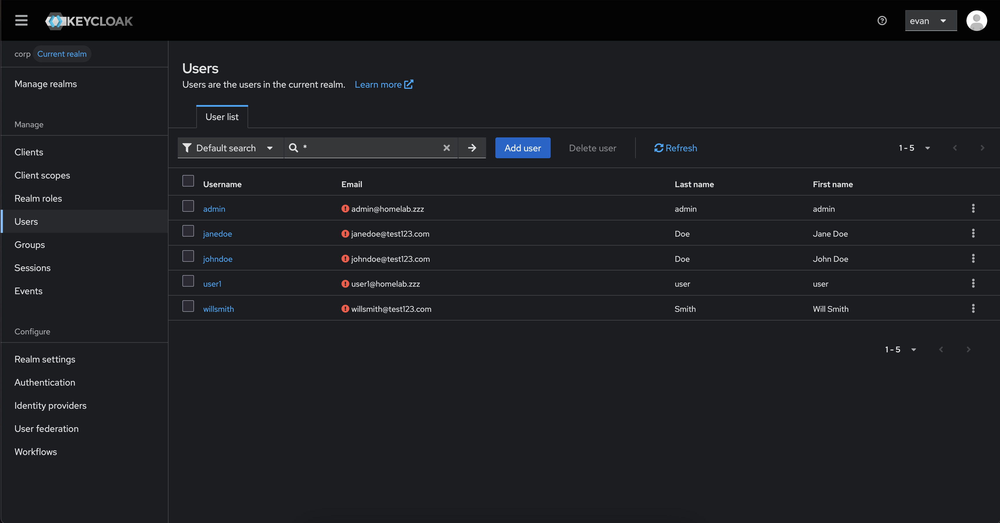
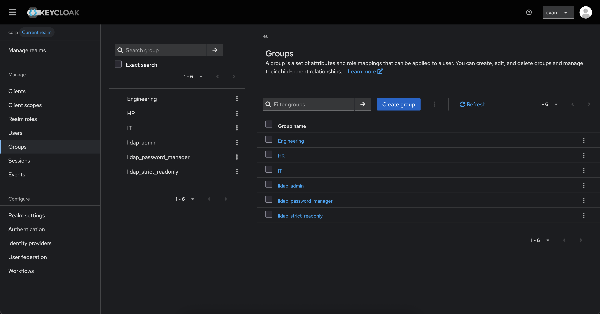
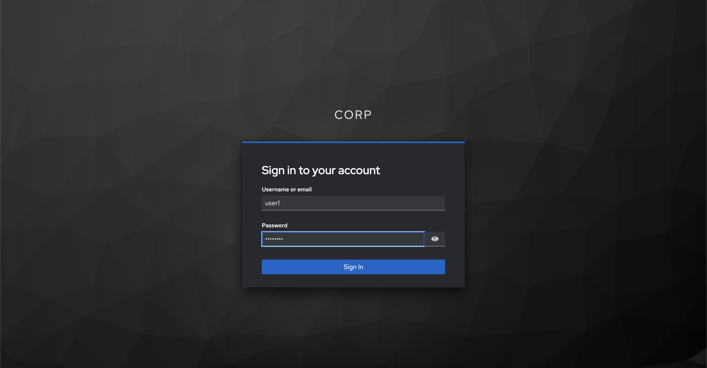
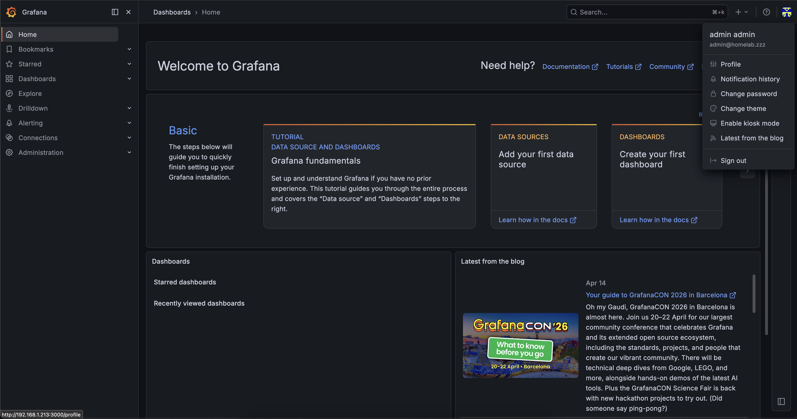
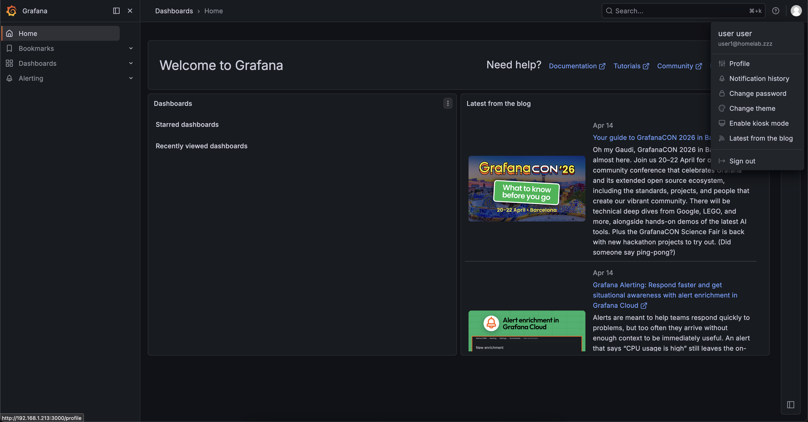

# 🔐 Keycloak IAM Homelab 

## 📌 Overview

This project implements a full Identity and Access Management (IAM) lab using:

- Keycloak as the Identity Provider (IdP)
- Grafana as a relying party (application)
- LLDAP as an external directory (identity source)

It demonstrates real-world IAM architecture patterns including:

- Single Sign-On (SSO) via OpenID Connect (OIDC)
- Multi-Factor Authentication (MFA) using TOTP
- Identity Federation (LDAP → Keycloak)
- Role-Based Access Control (RBAC)
- Token-based API authentication (JWT)

---

## 🔐 Keycloak Setup

A custom Keycloak realm provisioned as the top-level security boundary for this lab. The realm isolates IAM configuration—clients, users, roles, and identity providers—from the default master realm, mirroring how enterprises segment environments (e.g., dev, prod) in production deployments.
 
Realm-level roles defined in Keycloak (e.g., admin, viewer) that serve as the foundation for Role-Based Access Control across connected applications. These roles are later mapped to LDAP groups and used to enforce authorization policies in Grafana.

---

## 👥 LLDAP Setup

User accounts provisioned in LLDAP, a lightweight LDAP server acting as the external identity source for this lab. These users are later federated into Keycloak and can authenticate via SSO without being natively stored in Keycloak's internal database.
 
Groups created in LLDAP that correspond to access tiers within the application layer. Group membership in LLDAP is synchronized to Keycloak and drives role assignment through the LDAP federation mapper.

---

## 🔗 LDAP Federation

The LDAP User Federation configuration in Keycloak, establishing a live connection to the LLDAP server. Settings include the LDAP vendor, connection URL, bind credentials, and user DN—enabling Keycloak to query and sync identities from the external directory.
 
Attribute and group mappers configured as part of the LDAP federation. These mappers translate LDAP attributes (e.g., cn, mail) and group memberships into Keycloak user profile fields and realm roles, ensuring that LLDAP-managed identities are properly enriched when imported.

---

## 🔑 Grafana SSO

Grafana configured as an OIDC client (relying party) in Keycloak. This demonstrates a complete SSO flow—users who authenticate via Keycloak are issued a JWT, which Grafana validates to establish a session without requiring a separate login.
 
The Keycloak client scope and role mapping configuration that ties Keycloak realm roles to Grafana's internal role system. This is the bridge between identity (who you are) and authorization (what you can do) within the application. 

---

## 🛡️ RBAC

Grafana user sessions reflecting role assignments driven by Keycloak. Users federated from LLDAP are automatically granted the correct Grafana role (Admin or Viewer) based on their LDAP group membership, demonstrating end-to-end RBAC without manual Grafana user management.
 
A comparative demonstration of access levels enforced by RBAC—illustrating how a user with the viewer role sees a restricted Grafana interface compared to an admin, validating that the role mappings are correctly enforced at the application layer.

